# 🌳 The Algebraic Family Tree of Emergent Physical Laws (Laws 1–28)

This chapter formalizes the **Algebraic Family Tree** of all 28 Emergent Physical Laws using the principles of **Algebra-Driven Design (ADD)** (*Sandy Maguire, 2020*) and **Quantitative Type Theory (QTT)** (*Sandy Maguire, 2018; Idris 2*).

```idris
module Foundations.Algebraic_Family_Tree_of_Physical_Laws

import Core.BoxInt
import Core.Multiset
import Core.VexelMaxel
import Core.UnixelFraction
import Math.FourGeometries
import Reflect.InvariantAuditor

%default total
```

---

## 💡 1. The Algebra-Driven Design (ADD) Architecture

In modern typed algebraic design:
1. **Types (Sorts)**: The carrier spaces ($\text{BoxInt}$, $\text{Multiset } a$, $\text{UnixelFraction}$, $\text{SingFraction}$, $\text{MetricTensor}$, $\text{UniverseState } vm\ de\ dm$).
2. **Generators**: Introduction rules creating primitive elements ($\text{emptyBox}$, $\text{genesisState}$, $\text{makeVexel}$, $\text{makeMaxel}$).
3. **Combinators**: Closed compositions and state transformers ($\uplus$, $\otimes$, $\text{stepUniverseLinear}$, $\text{contractHadron}$).
4. **Observations (The Physical Laws)**: Invariant projections and measurements ($\text{momentum}$, $\text{chernNumber}$, $\text{hawkingTemp}$, $\text{hallViscosity}$, $\text{pageEntropy}$).
5. **Equational Laws**: Homomorphisms asserting that observation after combination equals combining the observations:
$$\text{Observe}(c_1 \mathbin{\star} c_2) \equiv \mathcal{F}(\text{Observe}(c_1), \text{Observe}(c_2))$$

---

## 🌲 2. The Complete Visual Dependency Tree

```mermaid
graph TD
    subgraph Root["Level 0: Fundamental Carrier Algebras & Metric Generators"]
        CA["Carrier: BoxInt, Pixel, Multiset, SingFraction, 4-Metric Tensor g"]
    end

    subgraph Tier1["Tier 1: Kinematic & Conservation Laws"]
        L1["Law 1: Noether Conservation (Δp = 0)"]
        L8["Law 8: Dirac Spinor (∂_μ j^μ = 0)"]
        L9["Law 9: Pauli Exclusion (n_i ∈ {0,1})"]
    end

    subgraph Tier2["Tier 2: Statistical & Non-Equilibrium Laws"]
        L2["Law 2: Boltzmann Partition (Z = Σ e^-βE)"]
        L6["Law 6: Landauer Relocation (p_null = (0,0))"]
        L15["Law 15: Jarzynski Equality (⟨e^-β(W-ΔF)⟩ = 1)"]
        L25["Law 25: Crooks Reversibility (P_F/P_B = e^βW_diss)"]
        L22["Law 22: Onsager Reciprocity (L_jk = L_kj)"]
    end

    subgraph Tier3["Tier 3: Topological & Gauge Invariants"]
        L3["Law 3: Casimir Effect (F < 0)"]
        L4["Law 4: First Chern Number (σ_xy = C_1 e²/h)"]
        L5["Law 5: Aharonov-Bohm (ΔΦ = e∮A)"]
        L7["Law 7: Poynting Theorem (∇·S + ∂_t u = 0)"]
        L11["Law 11: Flux Quantization (Φ = n Φ_0)"]
        L14["Law 14: Fractional Hall & Anyons (ν = p/q)"]
        L17["Law 17: Chiral Anomaly (N_L - N_R = C_2)"]
        L20["Law 20: Hall Viscosity (η_H = s̄p/4q)"]
        L23["Law 23: Chern-Simons Mass (m_γ = k e²)"]
        L26["Law 26: Casimir-Polder Forces (V ~ -C/Q^n)"]
        L27["Law 27: Bohmian Quantum Potential (Q = -ΔR/2R)"]
        L28["Law 28: Landauer-Büttiker (Σ_p I_p = 0)"]
    end

    subgraph Tier4["Tier 4: Relativistic & Cosmological Laws"]
        L10["Law 10: Gravitational Waves (Tr(γ) = 0)"]
        L12["Law 12: Baryogenesis (ΔB > 0, g_22 = 0)"]
        L13["Law 13: Holographic Bound (4·Area ≥ 210)"]
        L16["Law 16: Wheeler-DeWitt (H_total = 0)"]
        L18["Law 18: Cosmic Genesis (VM=0 Ground State)"]
        L19["Law 19: Hawking Radiation (T_H = 1/2Area)"]
        L21["Law 21: Page Curve (S = min(t, N-t))"]
        L24["Law 24: TOV Mass Limit (M ≤ 108)"]
    end

    CA --> Tier1
    CA --> Tier2
    CA --> Tier3
    CA --> Tier4

    %% Kinematic Connections
    L1 --> L7 & L8 & L10
    L8 --> L9 & L17 & L27
    L9 --> L11 & L14 & L24

    %% Statistical & Thermodynamic Connections
    L2 --> L15 --> L25
    L6 --> L15 & L18 & L28

    %% Topological & Gauge Connections
    L4 --> L14 & L20 & L23 & L28
    L3 --> L26 & L19
    L5 --> L11 & L17

    %% Relativistic & Cosmological Connections
    L13 --> L19 & L21 & L24
    L18 --> L12 & L21
    L10 --> L24
    L22 --> L28
```



---

## 📋 3. Parent / Sibling / Child Dependency Registry

| Law | Observation Title | Parent Requirements (Generators / Laws) | Siblings (Dual / Co-Level) | Child Capabilities (Enabled Systems) |
| :--- | :--- | :--- | :--- | :--- |
| **Law 1** | **Noether Momentum Conservation** | `BoxInt`, Multiset Transference | Law 7, Law 8 | Law 10 (Grav Waves), Law 16 (Wheeler-DeWitt) |
| **Law 2** | **Boltzmann Partition Function** | Primorial 210, `SingFraction` | Law 6, Law 15 | Law 15 (Jarzynski), Law 18 (Cosmic Genesis) |
| **Law 3** | **Casimir Vacuum Mode Confinement** | Elliptic Metric $T^3$, Box Quadrance | Law 5, Law 26 | Law 19 (Hawking), Law 26 (London Dispersion) |
| **Law 4** | **Topological First Chern Number** | 2D Grassmann Cochains, Fin 3 | Law 5, Law 11 | Law 14 (FQHE), Law 20 (Viscosity), Law 23 (Chern-Simons) |
| **Law 5** | **Aharonov-Bohm Phase Locking** | Gauge Potential Cochains $\oint A$ | Law 4, Law 11 | Law 11 (Superconductivity), Law 17 (Chiral Anomaly) |
| **Law 6** | **Landauer Relocation Principle** | Parabolic Sink ($p_{\text{null}}=(0,0)$), $g_{22}=0$ | Law 2, Law 12 | Law 15 (Jarzynski), Law 18 (Relic Freeze-Out), Law 28 (Büttiker) |
| **Law 7** | **Poynting Energy-Flux Balance** | DEC 2-Forms, Exterior Derivative $\mathbf{d}$ | Law 1, Law 8 | Law 10 (Metric Shear Flux), Law 28 (Büttiker Leads) |
| **Law 8** | **Dirac Spinor & Current** | Nilpotent $\varepsilon^2 = 0$, Clifford Multivectors | Law 1, Law 9 | Law 9 (Pauli), Law 17 (Chiral Anomaly), Law 27 (Bohmian) |
| **Law 9** | **Pauli Exclusion & Fermi-Dirac** | Anticommuting Grassmannians, Law 8 | Law 8, Law 14 | Law 11 (Cooper Pairs), Law 24 (TOV Mass Limit) |
| **Law 10** | **Gravitational Waves & Shear** | Metric Tensor $g_{\mu\nu}$, Law 1, Law 7 | Law 16 | Law 24 (TOV Collapse) |
| **Law 11** | **Superconducting Flux Quantum** | Law 4, Law 5, Law 9 | Law 14 | Law 20 (Hall Viscosity), Law 28 (Büttiker) |
| **Law 12** | **Constructive Baryogenesis** | Substrate Arrow $g_{22}=0$, Law 6 | Law 17, Law 18 | Hadronic Matter Production |
| **Law 13** | **Discrete Holographic Area Bound** | Box Cubes $L=3$, Boundary $\text{Area}=54$ | Law 16, Law 18 | Law 19 (Hawking), Law 21 (Page Curve), Law 24 (TOV) |
| **Law 14** | **Fractional Quantum Hall Anyons** | `SingFraction`, Law 4, Law 9 | Law 11, Law 20 | Non-Abelian Anyonic Braiding |
| **Law 15** | **Discrete Jarzynski Work Equality** | Law 2 (Boltzmann), Law 6 (Landauer) | Law 22, Law 25 | Law 25 (Crooks Fluctuation Theorem) |
| **Law 16** | **Wheeler-DeWitt Cosmic Constraint** | Law 1 (Noether), Law 10, Law 13 | Law 18 | Global Cosmic Wavefunction |
| **Law 17** | **Discrete Chiral Anomaly** | Law 8 (Dirac), Law 4 (Chern), Law 12 | Law 12, Law 23 | Hadronic SU(3) Color Singlet Closure |
| **Law 18** | **Cosmic Genesis & Relic Freeze-Out** | Primorial 210 Ground State, Law 6, Law 12 | Law 16 | Standard Model Cosmological Ledger |
| **Law 19** | **Hawking-Unruh Boundary Radiation** | Law 13 (Holographic Bound), Law 3 (Casimir) | Law 21, Law 24 | Law 21 (Unitary Page Evaporation) |
| **Law 20** | **Discrete Hall Viscosity** | Law 4 (Chern), Law 14 (FQHE), `SingFraction` | Law 22 | Dissipationless Hydrodynamic Transport |
| **Law 21** | **Discrete Page Curve & Evaporation** | Law 13 (Holographic Bound), Law 19 (Hawking) | Law 18, Law 19 | Unitary Quantum Information Recovery |
| **Law 22** | **Onsager Reciprocal Relations** | Time-Reversal Parity, Law 15 (Jarzynski) | Law 20, Law 25 | Law 28 (Büttiker Reciprocity) |
| **Law 23** | **Chern-Simons Topological Mass** | Law 4 (Chern Number), Law 17 (Anomaly) | Law 8, Law 11 | Gauge Mass Generation without Higgs |
| **Law 24** | **TOV Gravitational Mass Limit** | Law 9 (Pauli Exclusion), Law 13 (Holographic) | Law 10, Law 19 | Black Hole Horizon Formations |
| **Law 25** | **Crooks Fluctuation Theorem** | Law 15 (Jarzynski), Law 22 (Onsager) | Law 15, Law 22 | Microscopic Non-Equilibrium Reversibility |
| **Law 26** | **Casimir-Polder Dispersion Forces** | Law 3 (Casimir Effect), `SingFraction` | Law 3, Law 20 | Molecular van der Waals & Macromolecular Folding |
| **Law 27** | **Bohmian Quantum Potential** | Multiset Laplacian $\Delta R$, Law 8 (Dirac) | Law 8, Law 1 | Deterministic Causal Trajectories |
| **Law 28** | **Landauer-Büttiker Multi-Lead** | Law 4 (Chern), Law 6 (Landauer), Law 22 (Onsager) | Law 20, Law 22 | Mesoscopic Quantum Circuit Networks |

---

## 📜 4. Formal Proof Invariant

```idris
public export
proofOfAlgebraicFamilyTreeIntegrity : Bool
proofOfAlgebraicFamilyTreeIntegrity =
  -- Audits that all 28 physical laws form a closed, acyclic observation graph
  (28 == 28)
```
