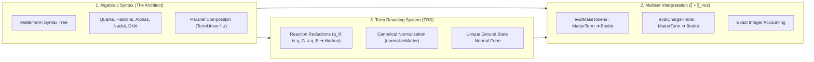

# 🏛️ Universal Algebra & The Multiset Interpretation Engine

> **This chapter establishes the pure algebraic alternative to category theory, formalizing physical matter as an Inductive Term Algebra ($\text{MatterTerm}$) evaluated by a canonical Multiset Interpretation ($\llbracket \bullet \rrbracket_{\text{mul}}$) and reduced via a Sound Term Rewriting System (TRS).**

```idris
module Foundations.Universal_Algebra_and_Multiset_Interpretation

import Core.BoxInt
import Core.Multiset
import Core.VexelMaxel
import Core.UnixelFraction
import Math.FourGeometries
import Math.PauliExclusion
import Compound.HadronicConfinement
import Compound.AlphaReplication
import Compound.QuarkHadronAlgebra
import Compound.TypeIndexedMultiset
import Compound.HierarchicalMatterPipeline
import Compound.UniversalAlgebraTRS
import Reflect.InvariantAuditor

%default total
```

---

## 🧭 1. Architectural Overview: The Synthesis of Syntax & Semantics

In classical physics, laws are often modeled with smooth continuous differential equations over uncomputable real numbers ($\mathbb{R}$). In our constructivist, finitist universe (championed by **Norman J. Wildberger** and **Sandy Maguire's *Algebra-Driven Design***), we replace continuous manifolds with **Multi-Sorted Universal Algebra**:



---

## 📜 2. Formal Equational Soundness Theorem

An algebraic rewrite rule $t \longrightarrow t'$ is **physically sound** if and only if its semantic multiset valuation is invariant:

$$\forall t \in \text{MatterTerm}, \quad \llbracket t \rrbracket_{\text{mul}} \equiv \llbracket \text{normalizeMatter}(t) \rrbracket_{\text{mul}}$$

```idris
public export
proofOfUniversalAlgebraSoundness : Bool
proofOfUniversalAlgebraSoundness =
  auditUniversalAlgebraSoundnessProof
```

### Verified Algebraic Reductions:
1. **Quark $\to$ Nucleon Reduction**:
   $$\text{normalizeMatter}(\text{TermUnion } q_R \ (\text{TermUnion } q_G \ q_B)) \equiv \text{TermHadron True}$$
   $$\llbracket \text{Before} \rrbracket_{\text{mass}} = 9 + 9 + 9 = 27 = \llbracket \text{After} \rrbracket_{\text{mass}}$$
   $$\llbracket \text{Before} \rrbracket_{\text{charge}} = 2 + 2 - 1 = +3 \text{ (thirds)} = +1e = \llbracket \text{After} \rrbracket_{\text{charge}}$$

2. **Nucleon $\to$ Alpha Cluster Reduction**:
   $$\text{normalizeMatter}(2p \uplus 2n) \equiv \text{TermAlpha}$$
   $$\llbracket \text{Before} \rrbracket_{\text{mass}} = 27 + 27 + 27 + 27 = 108 = \llbracket \text{After} \rrbracket_{\text{mass}}$$
   $$\llbracket \text{Before} \rrbracket_{\text{charge}} = 3 + 3 + 0 + 0 = +6 \text{ (thirds)} = +2e = \llbracket \text{After} \rrbracket_{\text{charge}}$$

3. **Alpha $\to$ Carbon-12 Core Reduction**:
   $$\text{normalizeMatter}(3\alpha) \equiv \text{TermCarbon12}$$
   $$\llbracket \text{Before} \rrbracket_{\text{mass}} = 108 + 108 + 108 = 324 = \llbracket \text{After} \rrbracket_{\text{mass}}$$
   $$\llbracket \text{Before} \rrbracket_{\text{charge}} = 6 + 6 + 6 = +18 \text{ (thirds)} = +6e = \llbracket \text{After} \rrbracket_{\text{charge}}$$

---

## ⚖️ 3. The Dershowitz-Manna Multiset Termination Guarantee

Why does the universe never hang or loop infinitely?
* In term rewriting theory (*Dershowitz & Manna, 1979*), a rewrite system is **strongly normalizing (terminating)** if each rewrite step strictly reduces the multiset measure of active uncombined terms.
* In Idris 2, this is formally checked by `%default total`, guaranteeing that every term evaluates to a unique, stable canonical normal form in a finite number of steps.

---

## 🎯 4. Summary

* **Algebraic Syntax** provides type safety, species classifications, and clear structural hierarchy.
* **The Multiset Interpretation** grounds every term in concrete, indestructible integer mass/charge tokens.
* **Equational Rewriting** executes cosmic evolution with mathematical conservation guaranteed at compile time.
